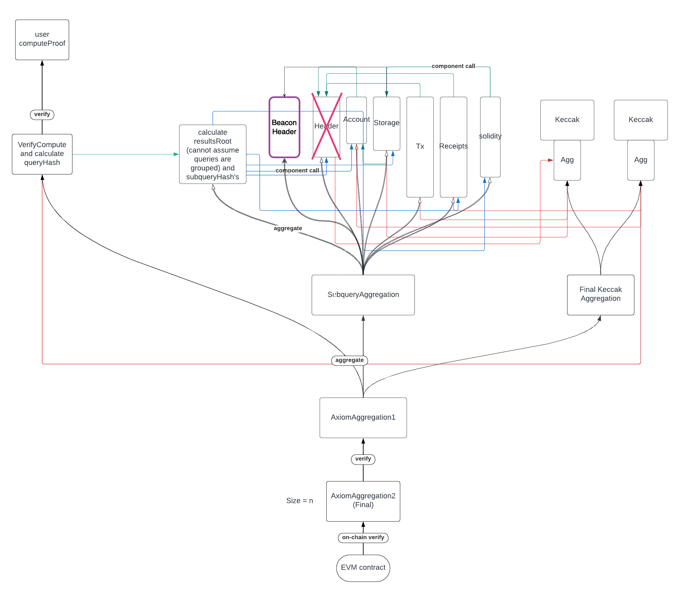

# Beacon header Axiom component via Spectre

Prototypes with Spectre (consensus) and Axiom (storage) proofs integration.

## [BeaconSubquery](/src/beacon_header)

`BeaconSubquery` is a drop-in replacement for Axiom’s `HeaderSubquery` component. Internally it composes [`StepCircuit`](https://github.com/ChainSafe/Spectre/blob/83b0bc1b4102657f9b295e2816d494d541cbd004/lightclient-circuits/src/sync_step_circuit.rs#L28) from [Spectre](https://github.com/ChainSafe/Spectre) to verify Beacon chain header. Then, via two Merkle proofs, it verifies the block number and arbitrary field from [`ExecutionPayloadHeader`](https://eth2book.info/capella/annotated-spec/#executionpayloadheader).



## IO 

### Subquery

Uses the same input and output as Axiom's `HeaderSubquery`:

```rust
struct HeaderSubquery {
    pub block_number: u32,
    pub field_idx: u32,
}
```

Output `HiLo` representation of the field value for a given index.

> **Note**: `field_idx`  is mapped to match the behavior of `HeaderSubquery` in Axiom.

### Circuit Instances
- commitHeaderComponent (F)
- promiseCommitment (F)
- committeePoseidon (F)

> `committeePoseidon` is a commitment to a vector of 512 public keys of a current sync committee verified in [CommitteeUpdateCircuit](https://github.com/ChainSafe/Spectre/blob/4f52085bb55a2b67554a2861cc7d59e8c7163dea/lightclient-circuits/src/committee_update_circuit.rs#L41)) 
